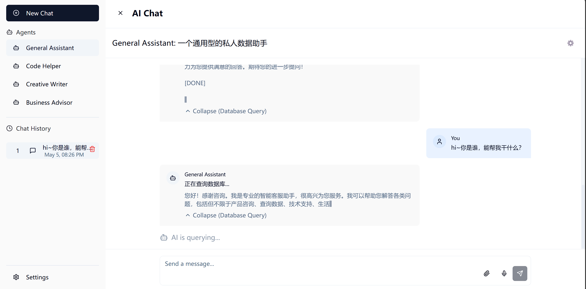
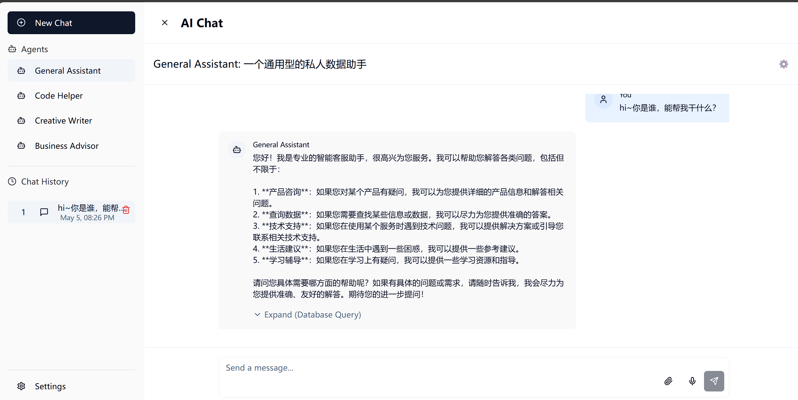

# Welcome to Chat-frontend-journey

## An easy-to-use intelligent customer service front-end




```sh
# Step 1: Clone the repository using the project's Git URL.
git clone <YOUR_GIT_URL>

# Step 2: Navigate to the project directory.
cd <YOUR_PROJECT_NAME>

# Step 3: Install the necessary dependencies.
npm i

# Step 4: Start the development server with auto-reloading and an instant preview.
npm run dev

# Step 5: Enter HTML Page.
Contrl + Left_Click 'Localhost:8080'
or
Enter URL 'Localhost:8080' in your browser.
```

## Technology Stack
This project is built with .
- Vite
- TypeScript
- React
- shadcn-ui
- Tailwind CSS

## Implement functions

- Front end speech to text input based on React
- An easy-to-use API management system (currently only supports Moonshot AI)
- Prompt with four different types of built-in assistants
- The return content of expandable backend LLM as a thinking process

## Backend adaptation

Replace the path of ChatInterface. tsx: 226 with your own backend database query URL (stream return).

FrontendDemo.exe is an example of backend adaptation for this project. The backend for this original code has already processed cross domain requests, so there is no need to configure CORS separately for this frontend.

**But you need to adaptation your own backend (DataBase, vector query, LLM) for this frontend projct.**

# This Project Based on a Lovable Static Project

## Origin Project(Static Page) info

**URL**: https://lovable.dev/projects/63dcd772-5825-4df4-ad3c-493162571b2a

## How can I edit Origin Project(Static Page) code?

There are several ways of editing your application.

**Use Lovable**

Simply visit the [Lovable Project](https://lovable.dev/projects/63dcd772-5825-4df4-ad3c-493162571b2a) and start prompting.

Changes made via Lovable will be committed automatically to this repo.

**Use your preferred IDE**

If you want to work locally using your own IDE, you can clone this repo and push changes. Pushed changes will also be reflected in Lovable.

The only requirement is having Node.js & npm installed - [install with nvm](https://github.com/nvm-sh/nvm#installing-and-updating)
